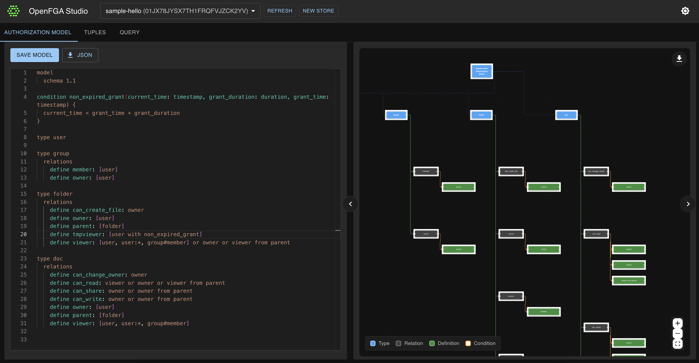
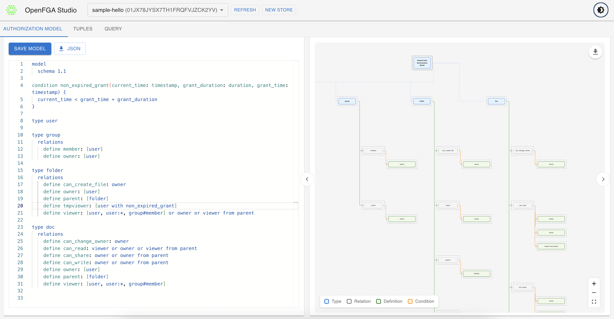
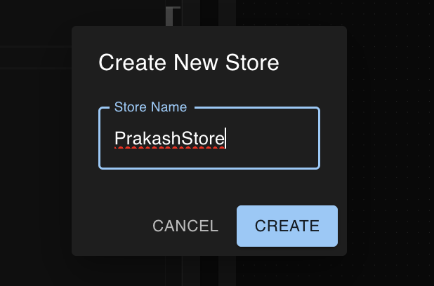
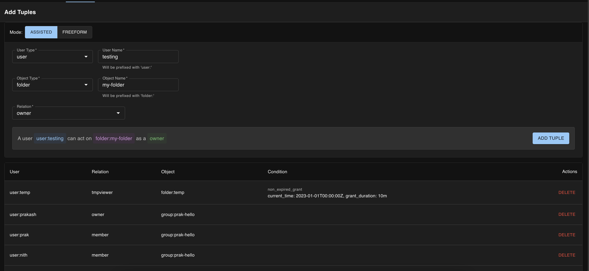
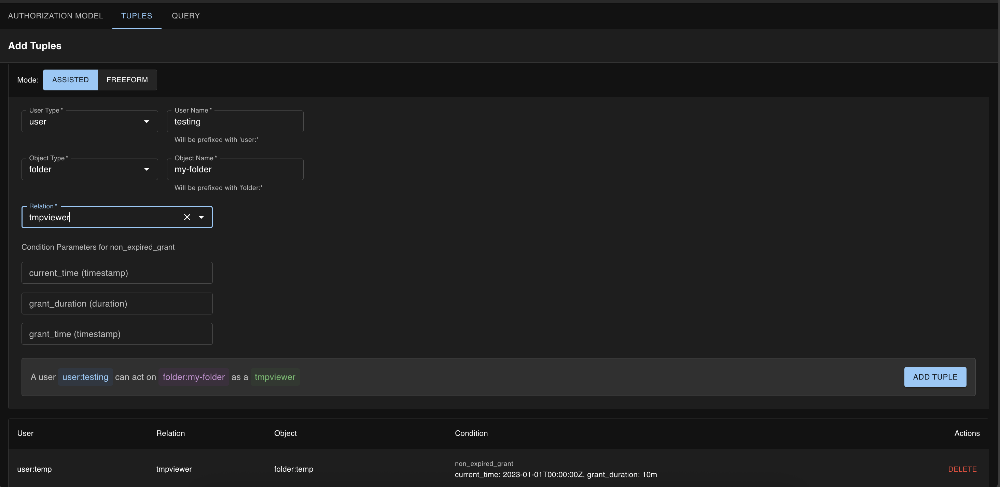
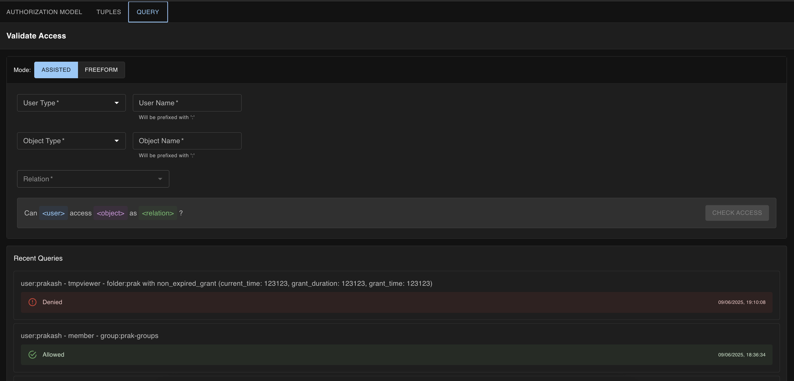
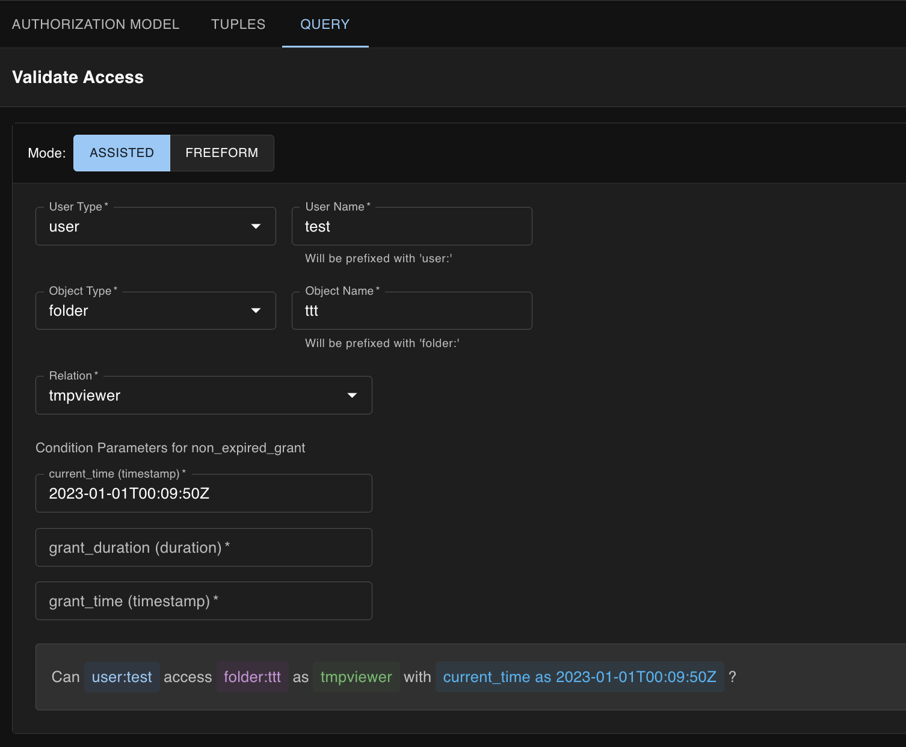

# OpenFGA Studio: An Open Source Authorization Modeling Interface

## Understanding OpenFGA

OpenFGA (Fine-Grained Authorization) is a high-performance authorization engine built for developers and inspired by Google's Zanzibar paper. It excels in handling complex authorization scenarios with features that make it stand out:

- **Relationship-Based Authorization**: Model complex access patterns through relationships
- **High Performance**: Process millions of authorization checks per second
- **Flexibility**: Support for RBAC, ABAC, and ReBAC models
- **Time-Based Access**: Define temporal access rules with built-in support
- **Proven Architecture**: Based on Google's battle-tested Zanzibar system

While OpenFGA Playground provides a [hosted application](https://play.fga.dev/sandbox/) for experimentation, it comes with limitations:
- Not open source
- Cannot be deployed in air-gapped environments
- Limited customization options
- Dependency on external services

## Why This Project?

I built OpenFGA Studio to address these limitations and provide:
- A fully open-source solution deployable anywhere
- Enhanced user experience for authorization modeling
- Complete control over your authorization data
- Customizable interface for specific needs
- Seamless integration with existing systems

OpenFGA Studio streamlines the process of creating, testing, and managing authorization models, making complex authorization logic more accessible and manageable. Built with modern web technologies including React, TypeScript, and Material-UI, it provides a robust and intuitive interface for working with OpenFGA.




## Development

👉 For detailed development instructions, see [DEVELOPMENT.md](DEVELOPMENT.md)

## Key Features

### 1. Store Management
The interface provides a straightforward way for managing OpenFGA stores. You can:
- Create new authorization stores
- Switch between existing stores
- View and manage store configurations
- Track model versions and changes



### 2. Visual Authorization Model Editor
The model editor is a powerful interface for defining authorization rules with features including:
- Syntax highlighting for better readability
- Real-time validation against OpenFGA schema
- Support for both DSL and JSON formats
- Error highlighting and suggestions
- Easy switching between model versions

### 3. Interactive Graph Visualization
Understand your authorization model at a glance with:
- Visual representation of relationships between types
- Interactive node exploration
- Relationship flow visualization
- Dynamic updates as you modify the model
- Zoom and pan controls for large models

### 4. Advanced Tuple Management
The tuple management interface makes it easy to define and manage relationships:



- Assisted tuple creation with type suggestions
- Support for direct (freeform) tuple input
- Batch operations for efficient management
- Reverse chronological listing of tuples
- Quick delete operations

### 5. Conditional Relationship Support
Handle complex authorization scenarios with conditional relationships:



- Dynamic condition parameter inputs
- Type-aware parameter validation
- Timestamp and duration support
- Visual feedback for condition state

### 6. Comprehensive Query Testing
Test your authorization rules with an intuitive interface:



Features include:
- Visual query builder
- Direct query input support
- Real-time query validation
- Historical query tracking
- Quick query replay

### 7. Conditional Access Testing
Test complex conditional access patterns:



- Test time-based access rules
- Validate contextual conditions
- Dynamic parameter inputs
- Clear success/failure indicators

### 8. Developer-Friendly Features
OpenFGA Studio is built with developers in mind:
- Clean, modern UI with dark mode support
- Keyboard shortcuts for common operations
- Copy/paste support for all fields
- Detailed error messages
- Response timing information

## Technical Implementation

OpenFGA Studio is built with modern web technologies:
- **Frontend**: React with TypeScript for type safety
- **UI Framework**: Material-UI for consistent, responsive design
- **State Management**: React hooks and context for efficient state handling
- **Build Tool**: Vite for fast development and optimized production builds
- **API Integration**: Axios for reliable API communication
- **Graph Visualization**: React Flow for interactive model visualization

## Common Use Cases

1. **Authorization Modeling**
   - Design role-based access control (RBAC) systems
   - Implement attribute-based access control (ABAC)
   - Model relationship-based authorization

2. **Testing and Validation**
   - Verify access control rules
   - Test time-based permissions
   - Validate complex conditional access

3. **Development and Debugging**
   - Debug authorization issues
   - Prototype authorization models
   - Document access control patterns

## Conclusion

OpenFGA Studio simplifies the complex task of fine-grained authorization modeling and testing. Whether you're designing a new authorization system or maintaining an existing one, this tool provides the features needed to work efficiently with OpenFGA.

The combination of visual tools, intuitive interfaces, and powerful testing capabilities makes it an essential tool for developers working with authorization systems. The tool continues to evolve with new features and improvements based on community feedback and real-world usage patterns.

## Running the image and examples

### 1. Default (Embedded OpenFGA)
The container starts an embedded OpenFGA instance by default. This is perfect for local development or quick testing.

```bash
# UI available at http://localhost:3000
# Embedded OpenFGA HTTP API at http://localhost:8080
# Embedded OpenFGA gRPC at localhost:8081
docker run -p 3000:3000 -p 8080:8080 -p 8081:8081 ghcr.io/prakashm88/openfga-studio
```

### 2. External OpenFGA (Production/Integration)
You can point the Studio to an existing OpenFGA instance (e.g., OpenFGA Cloud, Render, or another container). There are two ways to configure this:

#### Option A: Using `OPENFGA_ENDPOINT` (Recommended)
Simply provide the full URL to your OpenFGA API. This handles scheme, host, port, and path prefixes automatically.

```bash
# Example: Connecting to a hosted instance with a path prefix
docker run -p 3000:3000 \
  -e OPENFGA_ENDPOINT=https://openfga-studio.onrender.com/api \
  ghcr.io/prakashm88/openfga-studio
```

#### Option B: Using Individual Components
You can also configure the connection using specific environment variables.

```bash
docker run -p 3000:3000 \
  -e OPENFGA_SCHEME=https \
  -e OPENFGA_HOST=openfga-studio.onrender.com \
  -e OPENFGA_PATH_PREFIX=api \
  ghcr.io/prakashm88/openfga-studio
```

**Available Variables:**
- `OPENFGA_ENDPOINT`: Full URL (e.g., `https://api.example.com/v1`). Takes precedence if set.
- `OPENFGA_HOST`: Hostname (e.g., `api.example.com`).
- `OPENFGA_SCHEME`: `http` or `https` (default: `http`).
- `OPENFGA_HTTP_PORT`: Port number (default: `80` for http, `443` for https, or `8080` for localhost).
- `OPENFGA_GRPC_PORT`: gRPC Port number (default: `8081`).
- `OPENFGA_PATH_PREFIX`: URL path prefix (e.g., `api` or `/v1`).

### 3. Advanced Configuration
- **Force UI Only**: `DISABLE_LOCAL_OPENFGA=true` (useful if you don't want the embedded instance to start, even if no external host is configured).
- **Force Local Instance**: `ENABLE_LOCAL_OPENFGA=true` (forces embedded instance even if external variables are present).

### Developing & testing the UI locally (npm)

You can run and test the UI without building the Docker image.

- Install dependencies:

  npm install

- Run the dev server (fast, HMR). The dev server proxies `/api` to `http://localhost:8080` by default:

  npm run dev

  (dev server default port: `5173`)

- Build and preview a production bundle:

  VITE_OPENFGA_API_URL=http://localhost:8080 npm run build
  npm run preview

- Point the UI at an existing OpenFGA instance:
  - Set `VITE_OPENFGA_API_URL` to the full API URL (example: `http://openfga.example.com:8080`) when running `npm run dev` or when building the app. Example:

    VITE_OPENFGA_API_URL=http://openfga.example.com:8080 npm run dev

  - Alternatively, create a `.env.local` file with `VITE_OPENFGA_API_URL="http://openfga.example.com:8080"`.

- Notes on CORS & proxying:
  - The dev server proxies `/api` to `http://localhost:8080` by default (see `vite.config.ts`). If you point to an external OpenFGA, either enable CORS on that server or configure the `server.proxy` block in `vite.config.ts` to route API calls through the dev server.

- Running a local OpenFGA for development:
  - Download and run the OpenFGA binary (see https://github.com/openfga/openfga/releases) and start with:

    ./openfga run --http-addr 0.0.0.0:8080 --grpc-addr 0.0.0.0:8081

  - Or run an existing OpenFGA container and point the UI at it (set `VITE_OPENFGA_API_URL` or rely on the proxy).

### Docker Compose example

An example docker-compose file is available at `examples/docker-compose.yml`. It shows a development setup (default local OpenFGA) and an example for pointing to an external OpenFGA provider.
